# Procesverslag
**Auteur:** Klaudija Miskovic

**De opdrachten:** [opdracht 1](opdracht1/index.html) en [opdracht 2](opdracht2/index.html)

Markdown is een simpele manier om HTML te schrijven.  
Markdown cheat cheet: [Hulp bij het schrijven van Markdown](https://github.com/adam-p/markdown-here/wiki/Markdown-Cheatsheet).

## Bronnenlijst
  1. https://codepen.io/shooft/pen/oNoZQaQ?editors=1100
  2. https://www.ryadel.com/en/css3-media-query-target-only-ie-ie6-ie11-firefox-chrome-safari-edge/
  3. https://developer.mozilla.org/en-US/docs/Web/CSS/transform-function/rotateY()
  4. https://codepen.io/uurrnn/pen/WNLVdN?editors=1100
  5. 

## Opdracht 1 plan

  
uitwerken na schetsen idee (voor week 2)

  ### Je storyboard:
    

  ### Je ambitie: 
  Aan deze technieken/punten wil ik werken:
  - CSS skills wat verbeteren
  - Meer leren over animaties met css ( met name de verschillende mogelijkheden tot animeren)
  - Het leren om een figuur(tje) te maken met puur CSS
  - ::before & ::after
  - Van een schets tot het werkend maken met html/css

 
  
  
  
  

## Opdracht 1 reflectie

  
uitwerken bij afronden opdracht (voor week 3)

  ### Je uitkomst - karakteristiek screenshot(s):
  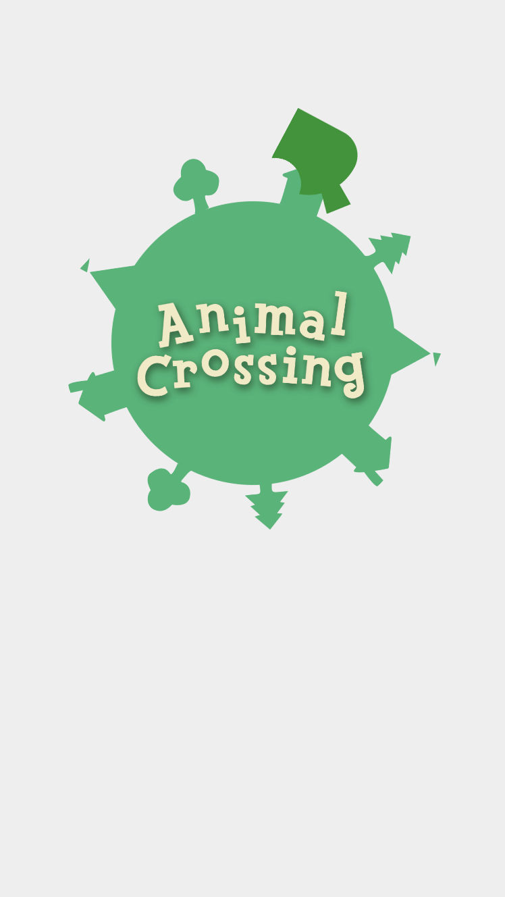  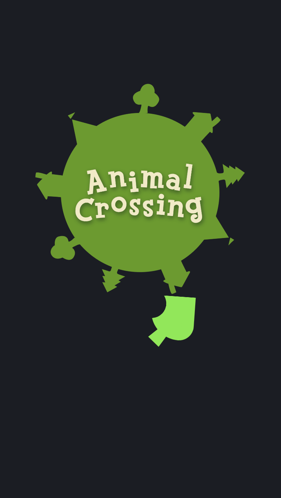
  
   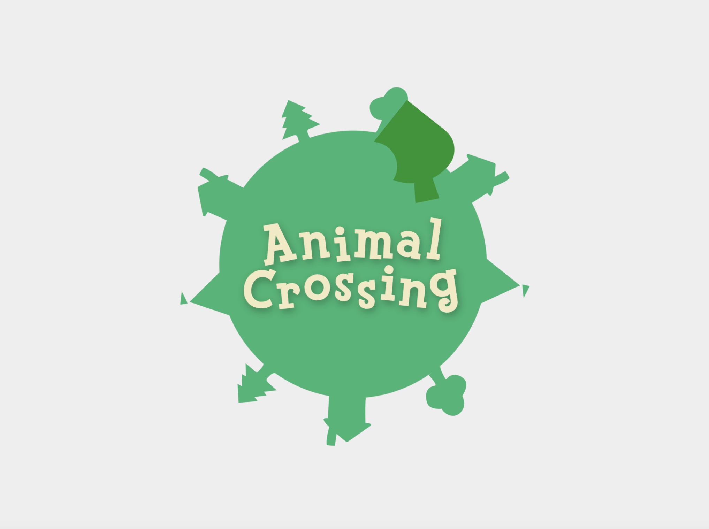  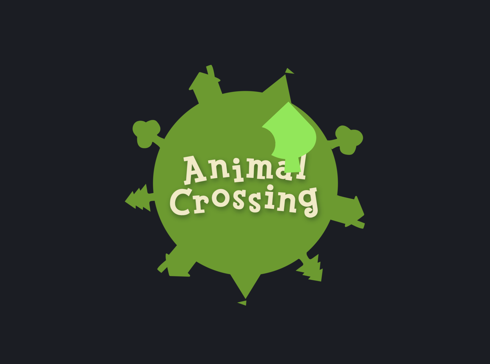

  ### Dit ging goed/Heb ik geleerd: 
  Korte omschrijving met plaatje(s)
  
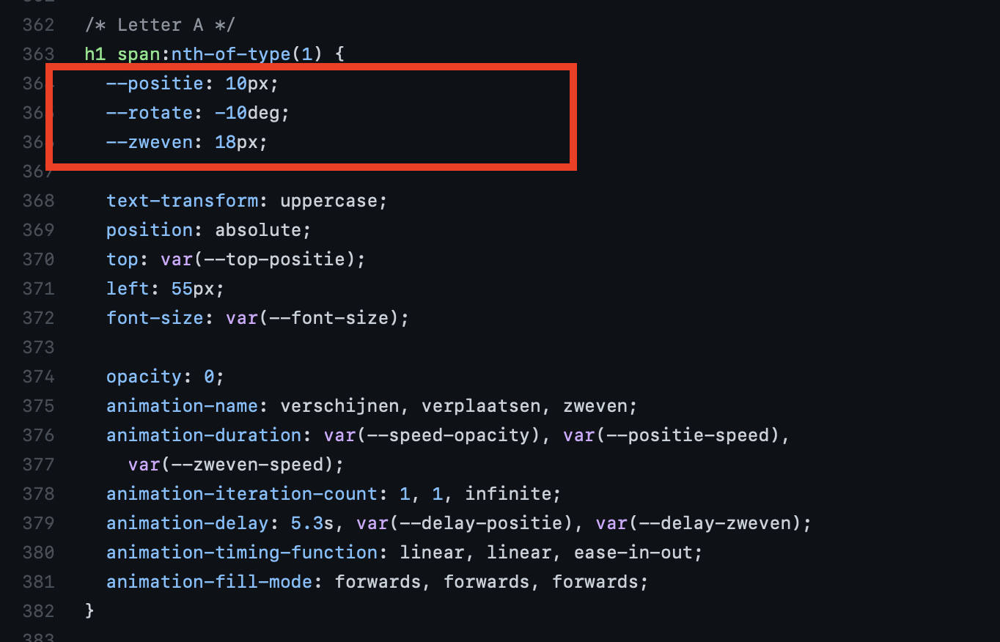 Wat ik geleerd heb is hoe voor meerdere elementen met behulp van custom properties maar 1 animatie hoeft te gebruiken.
  
  
  
  
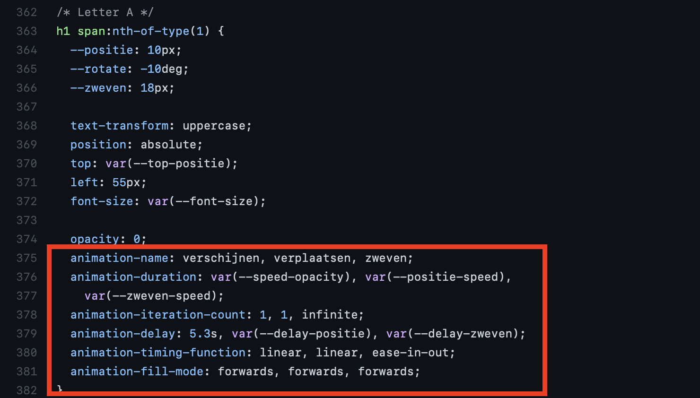 Waar ik zelf even mee zat te worstelen maar uiteindelijk wel snel goed gekomen is is het gebruiken van meerdere animaties achter elkaar.
  
  
 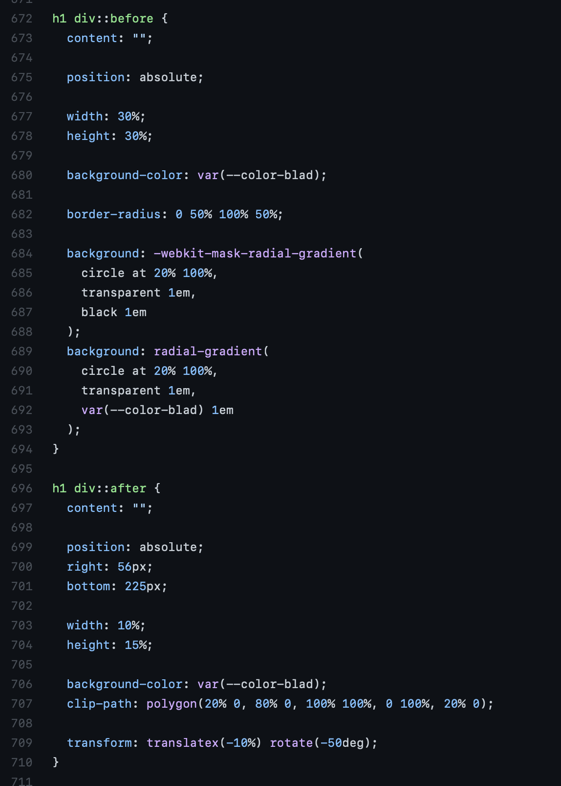 Door de voorbeeld van Sanne heb ik wat beter beel gekregen voor het gebruiken van de ::before & ::after.
  
 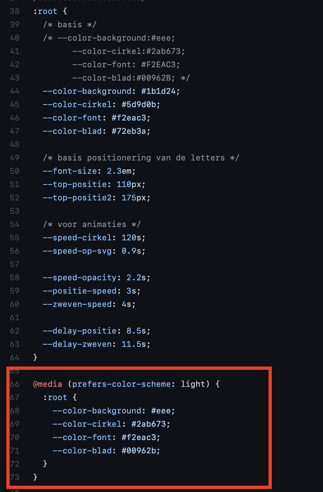 Wat ik heb geleerd is dat je ook op deze manier (met de @media ) de light en dark mode kan stijlen. Zelf heb ik het altijd met javascript gedaan, maar de @media is veeel makkelijker:)
  
  
  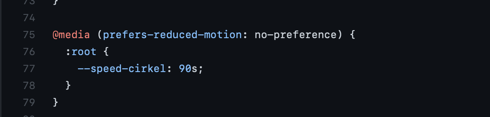 Zelf wist ik niet dat je ook met de @media de reduce motion kunt veranderen/aanpassen

  ### Dit was lastig/Is niet gelukt:
  Korte omschrijving met plaatje(s)

 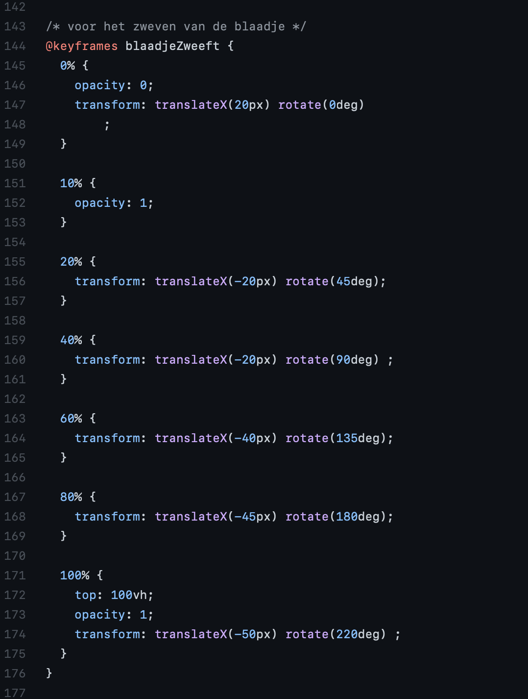 Wat mij nog niet gelukt is om de animatie op het eind wat smoother te maken, in het begin lijkt het echt als of het blad zweeft, maar op het eind is dit wat minder.
  
 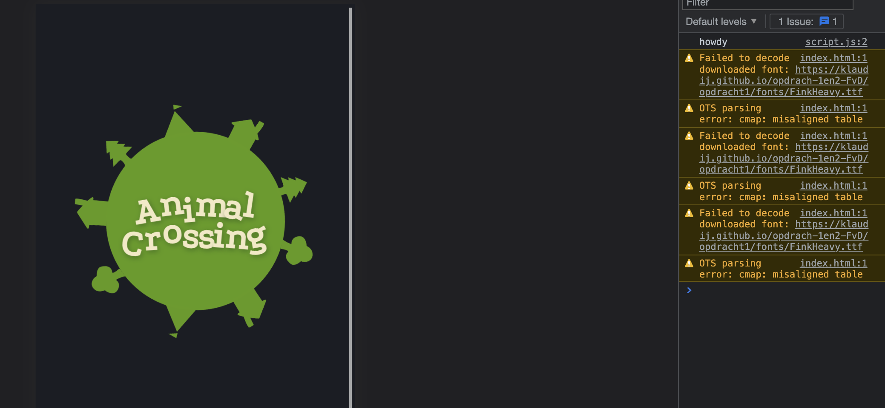 Op de een of andere manier wilt de font niet in chrome laden maar alleen wel in safari. Dus heb ik een extra font toegevoegd mocht de eerste niet laden. Maar toen zat ik weer met het probleem dat de positie van de letters niet helemaal goed stonden in chrome vanwege het gebruik maken van de andere font. Dus ik vond het nog best wel lastig om het nog alleen in chrome de positie van de letters aan te passen.
  

## Opdracht 2 plan

  
uitwerken na schetsen idee (voor week 4)

  ### Je ontwerp:
  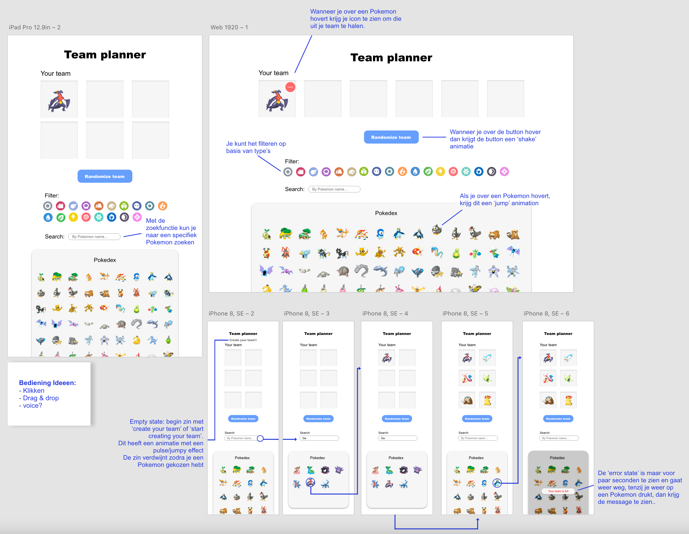 
  Wat ik wil gaan maken is een pokemon team planner, waarbij je uit de pokedex list tot max 6 pokemons kan toevoegen aan je team.

  ### Je ambitie: 
  Aan deze technieken/punten wil ik werken:
  - Hoe API werkt
  - API gebruiken in mijn eigen opdracht
  - Maken van een filter
  - Search bar gebruiken (en dat het daadwerkelik werkt)
  - Javascript skills verbeteren
  - microinteracties verwerken

## Opdracht 2 reflectie

  
uitwerken bij afronden opdracht (voor week 8)

  ### Je uitkomst - karakteristiek screenshot(s):
  

  ### Dit ging goed/Heb ik geleerd: 
  Korte omschrijving met plaatje(s)

  

  ### Dit was lastig/Is niet gelukt:
  Korte omschrijving met plaatje(s)

  

