# Procesverslag
**Auteur:** Klaudija Miskovic

**De opdrachten:** [opdracht 1](opdracht1/index.html) en [opdracht 2](opdracht2/index.html)

Markdown is een simpele manier om HTML te schrijven.  
Markdown cheat cheet: [Hulp bij het schrijven van Markdown](https://github.com/adam-p/markdown-here/wiki/Markdown-Cheatsheet).

## Bronnenlijst
  1. https://codepen.io/shooft/pen/oNoZQaQ?editors=1100
  2. https://www.ryadel.com/en/css3-media-query-target-only-ie-ie6-ie11-firefox-chrome-safari-edge/
  3. https://developer.mozilla.org/en-US/docs/Web/CSS/transform-function/rotateY()
  4. https://codepen.io/uurrnn/pen/WNLVdN?editors=1100
  5. 

## Opdracht 1 plan

  
uitwerken na schetsen idee (voor week 2)

  ### Je storyboard:
    

  ### Je ambitie: 
  Aan deze technieken/punten wil ik werken:
  - CSS skills wat verbeteren
  - Meer leren over animaties met css ( met name de verschillende mogelijkheden tot animeren)
  - Het leren om een figuur(tje) te maken met puur CSS
  - ::before & ::after
  - Van een schets tot het werkend maken met html/css

 
  
  
  
  

## Opdracht 1 reflectie

  
uitwerken bij afronden opdracht (voor week 3)

  ### Je uitkomst - karakteristiek screenshot(s):
    
  
     

  ### Dit ging goed/Heb ik geleerd: 
  Korte omschrijving met plaatje(s)
  
 Wat ik geleerd heb is hoe voor meerdere elementen met behulp van custom properties maar 1 animatie hoeft te gebruiken.
  
  
  
  
 Waar ik zelf even mee zat te worstelen maar uiteindelijk wel snel goed gekomen is is het gebruiken van meerdere animaties achter elkaar.
  
  
  Door de voorbeeld van Sanne heb ik wat beter beel gekregen voor het gebruiken van de ::before & ::after.
  
  Wat ik heb geleerd is dat je ook op deze manier (met de @media ) de light en dark mode kan stijlen. Zelf heb ik het altijd met javascript gedaan, maar de @media is veeel makkelijker:)
  
  
   Zelf wist ik niet dat je ook met de @media de reduce motion kunt veranderen/aanpassen

  ### Dit was lastig/Is niet gelukt:
  Korte omschrijving met plaatje(s)

  Wat mij nog niet gelukt is om de animatie op het eind wat smoother te maken, in het begin lijkt het echt als of het blad zweeft, maar op het eind is dit wat minder.
  
  Op de een of andere manier wilt de font niet in chrome laden maar alleen wel in safari. Dus heb ik een extra font toegevoegd mocht de eerste niet laden. Maar toen zat ik weer met het probleem dat de positie van de letters niet helemaal goed stonden in chrome vanwege het gebruik maken van de andere font. Dus ik vond het nog best wel lastig om het nog alleen in chrome de positie van de letters aan te passen.
  

## Opdracht 2 plan

  
uitwerken na schetsen idee (voor week 4)

  ### Je ontwerp:
   
  Wat ik wil gaan maken is een pokemon team planner, waarbij je uit de pokedex list tot max 6 pokemons kan toevoegen aan je team.

  ### Je ambitie: 
  Aan deze technieken/punten wil ik werken:
  - Hoe API werkt
  - API gebruiken in mijn eigen opdracht
  - Maken van een filter
  - Search bar gebruiken (en dat het daadwerkelik werkt)
  - Javascript skills verbeteren
  - microinteracties verwerken

## Opdracht 2 reflectie

  
uitwerken bij afronden opdracht (voor week 8)

  ### Je uitkomst - karakteristiek screenshot(s):
  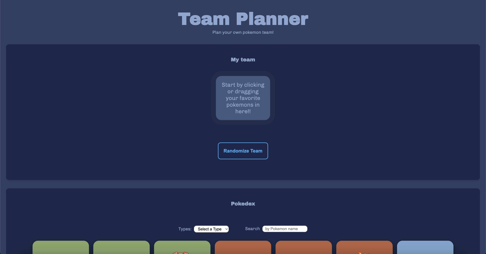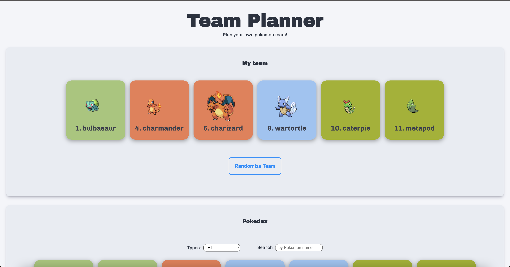 
  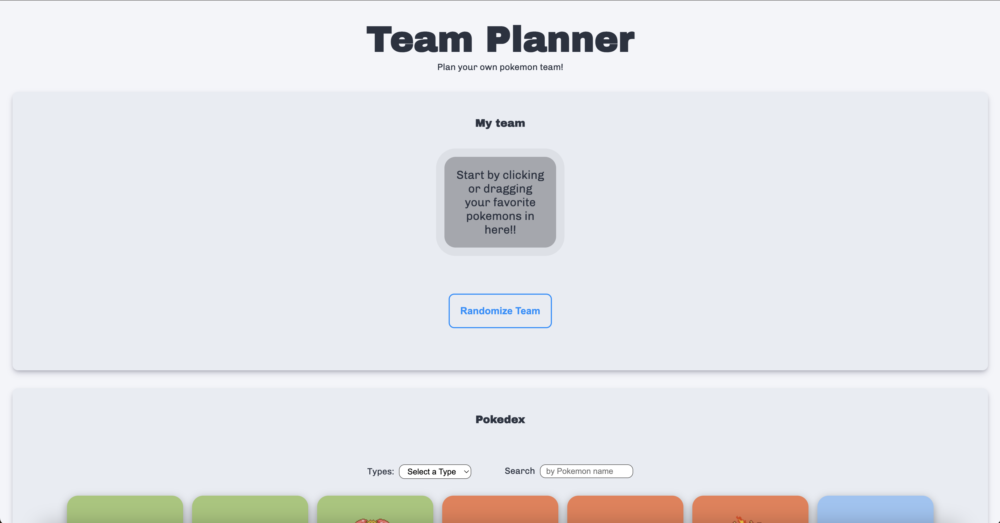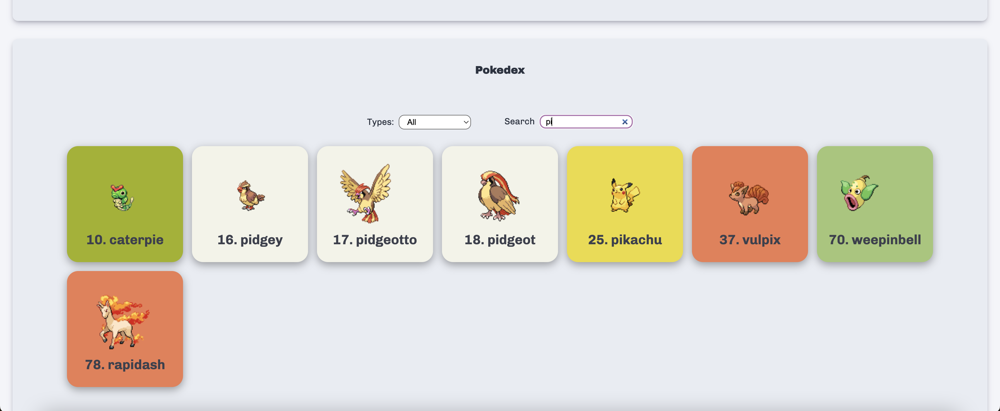 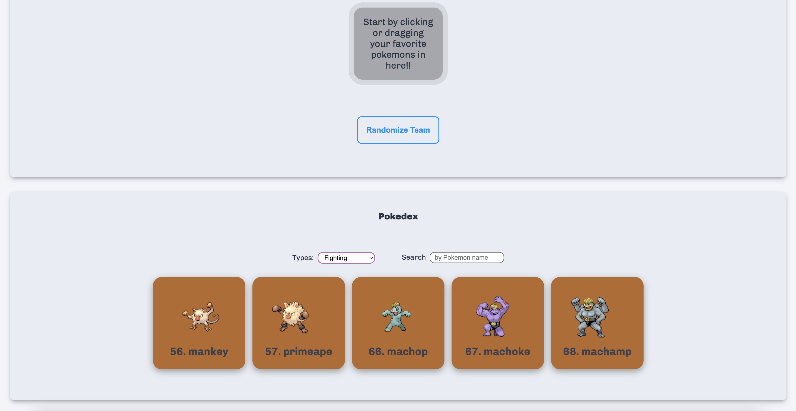  
  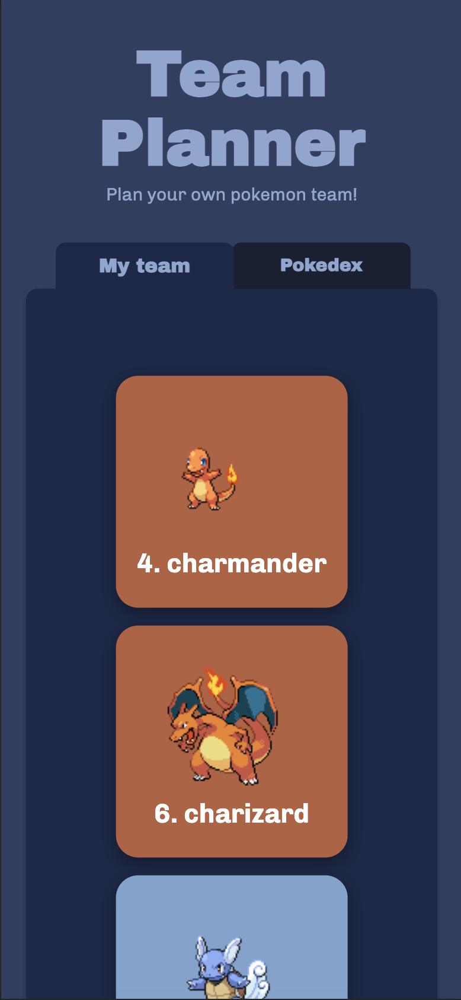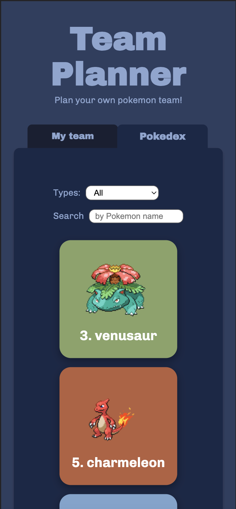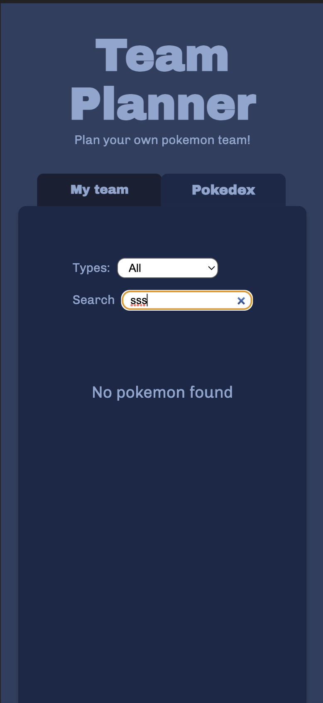 

  ### Dit ging goed/Heb ik geleerd: 
  Korte omschrijving met plaatje(s)

  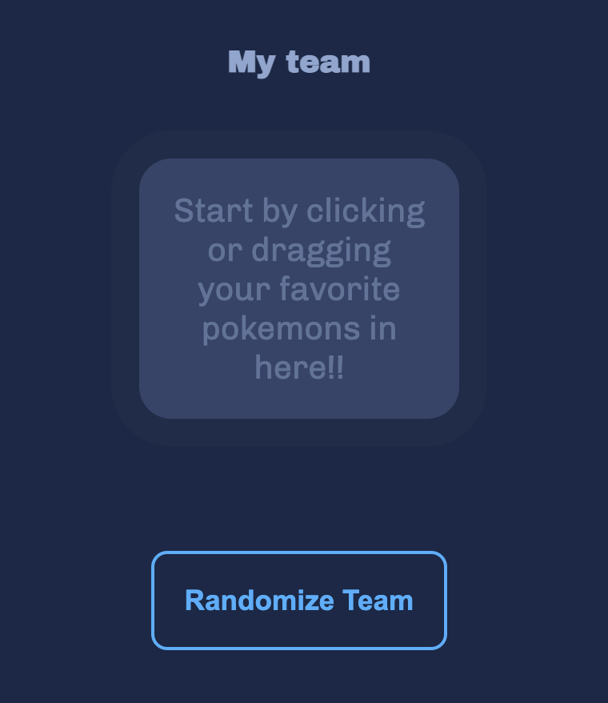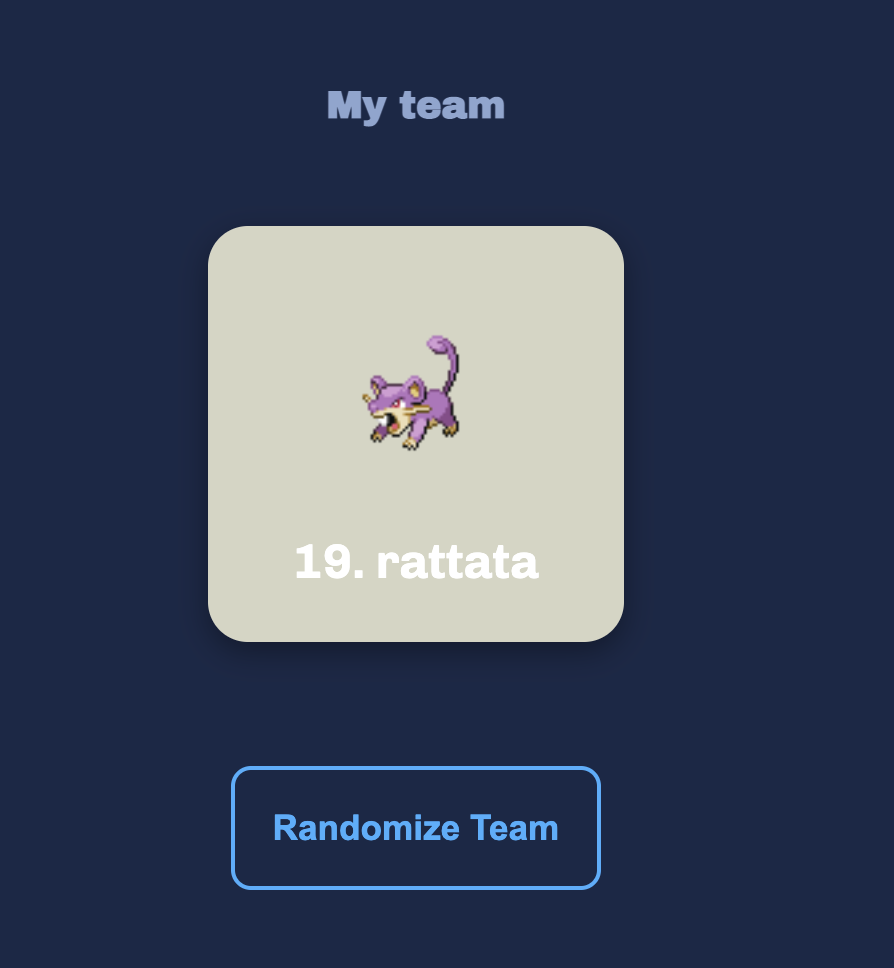 
Wat ik geleerd is dat wanneer een ul leeg is dat je zelfs dit ook nog kan stijlen en zodra er een li in de ul zit dat de :empty 'state' verdwijnt. En ik wist helemaal niet dat dit zelfs mogelijk was. Dus ik vond het best leuk en interresant om hiermee te werken. Zelf heb ik er ook nog een ::before en ::after eraan gekoppeld, ik vond het namelijk wat makkelijker om hiermee de 'empty state' te stijlen.  
   
    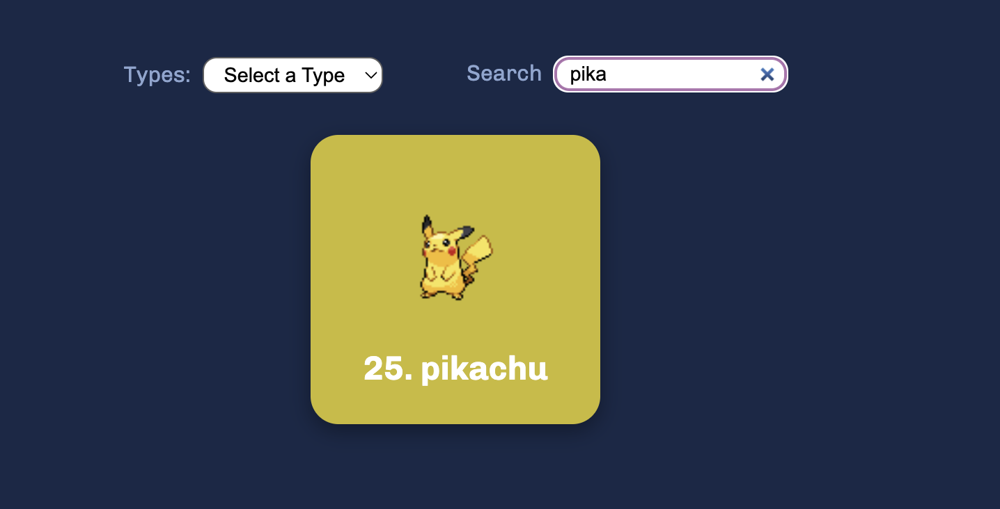  
Wat ik geleerd heb is dat je gebruik kan maken van js libraries. Een voorbeeld van wat ik gebruikt heb is de list.js hiermee kan je de searchbar werkend maken. Ik vond het wel een beetje lastig om dit in mijn opdracht te verwerken want in de voorbeeld opdracht stond de library buiten een funtie en ik (na wat puzzelen eindelijk gevonden) moest de library in 'getPokemon' functie plaatsen om het te laten werken.  
   
  
  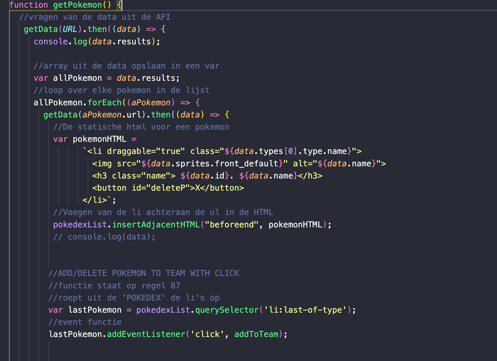  
Wat ik ook geleerd heb is hoe je vanuit de data wat je uit de API heb opgehaald, dit in een statische html elementen gooien en dit weer laden in de HTML.  
   
  
   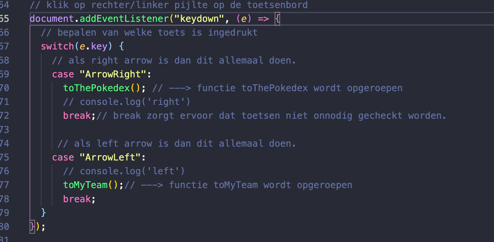  
De keyborad functie is voor mij zeker een refresher geweest. Dit hebben wij vorig jaar tijdens het vak 'Inleiding programeren' gehad maar omdat zo lang geleden was ben ik het alweer vergeten hoe het moest. Maar de 'break:' is wel iets wat nieuw was voor mij. Dit zorgt er namelijk voor dat de andere toetsen onnidig gechekt worden.  
   
  
  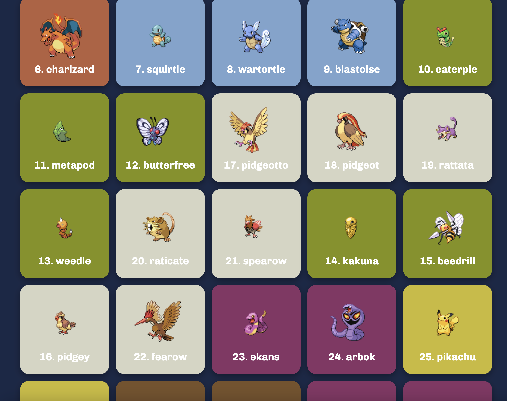  
Wat ik vond wat ook is goed gegaan is nadat de 'filter op type' functie werkte, heb ik ervoor gezorgd dat elk type zijn eigen background color heeft. Eerst waren ze allemaal 1 kleur en dit kan misschien toch wat onduidelijkheden opwekken, met kleur is het wat duidelijker. 
   
  
  
   

  ### Dit was lastig/Is niet gelukt:
  Korte omschrijving met plaatje(s)

  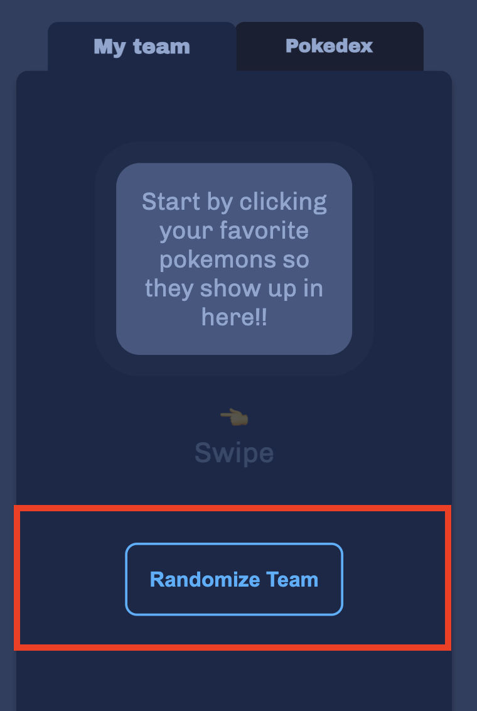 
  Wat ik nog van plan was om te maken is dat je met de randomize button een random team kan genereren. De button staat er al alleen de js is niet gelukt. Ik had wel geprobeerd om het te maken en zat er mee te puzzelen, maar ben er niet op uitegekomen. Omdat dit niet de belangsrijkte functie is voor op de website heb ik besloten om die te laten. De button heb ik wel achtergelaten mocht ik verder aan willen werken.  
   
  
 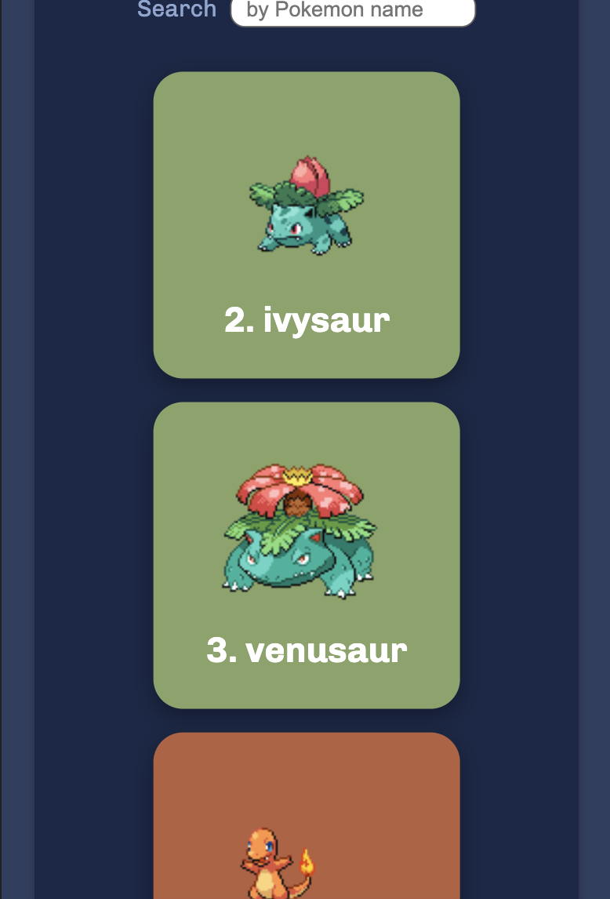 
  Wat ik in het begin nog een beetje lastig vond was de API. Ik heb er nog nooit meegewerkt, en heb er zeker geen spijt van dat ik ervoor heb gekozen om dit in mijn opdracht te verwerken. Want zo heb ik toch wel iets nieuwe geleerd. Wat ik er nou zo lastig aan vond is dat wanneer ik b.v. een zoekfunctie of een filter functie wou verwerken wist ik niet zo goed hoe ik dit moest aanpakken. 
     

